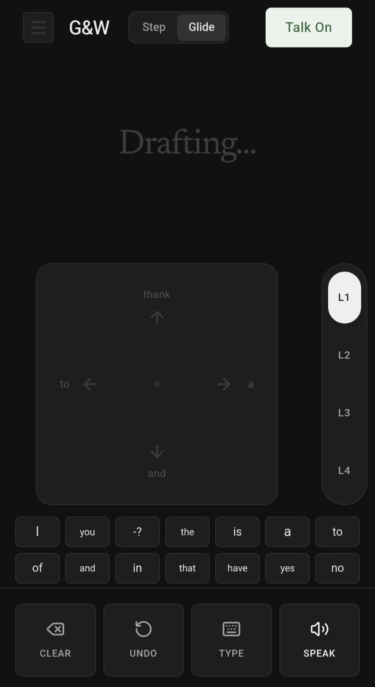
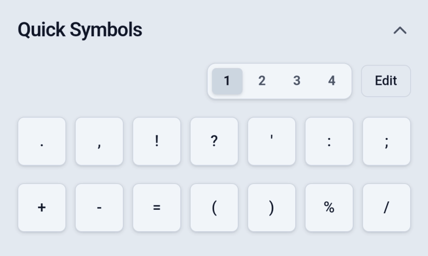
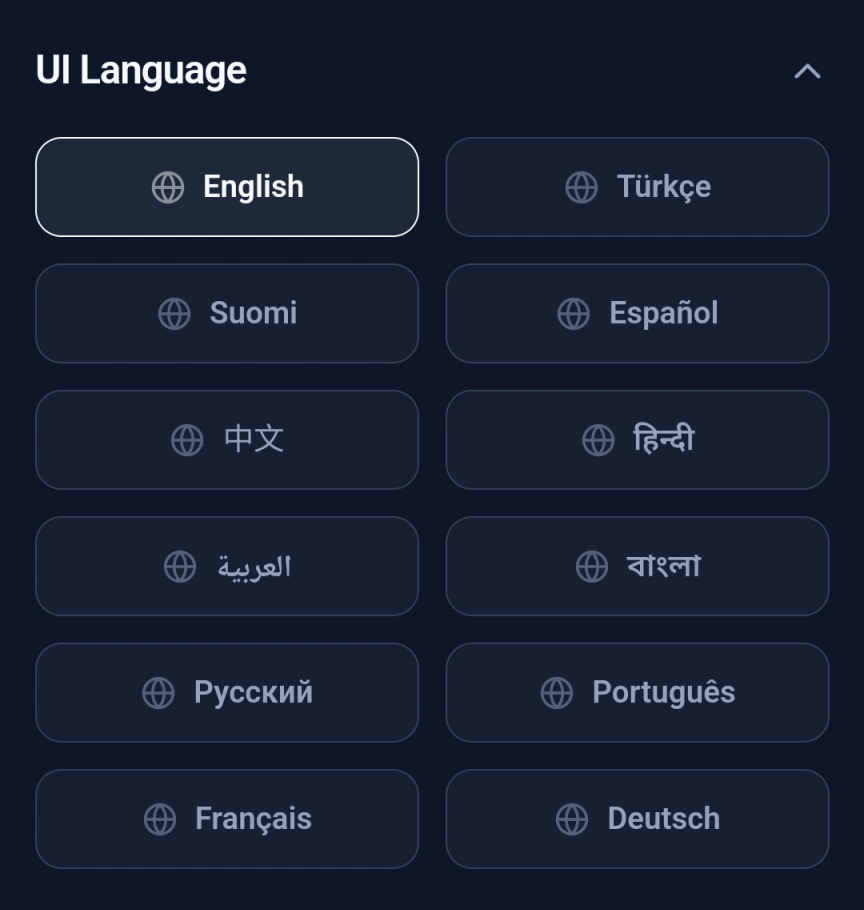

<div align="center">
  
  <h1>Glide & Write</h1>
  <p>
    <a href="https://glideandwrite.org/">Website</a> • 
    <a href="mailto:hello@glideandwrite.org">Contact</a> •
    <a href="https://www.patreon.com/GlideWrite">Patreon</a> •
    <a href="https://opencollective.com/glide-and-write">Open Collective</a>
  </p>
</div>

**Glide & Write** is an intuitive, accessible, and gesture-based communication application (AAC) specifically designed to help non-verbal individuals, or those with speech impairments, communicate rapidly and effectively with the people around them (doctors, teachers, police, family, etc.).

## 💡 The Story Behind & Purpose

**The Inspiration:** My wife was laughing while watching a stand-up routine by a comedian named Ahren Belisle on YouTube Shorts. Ahren was non-verbal, but he was performing stand-up by typing on his phone and having the text spoken out loud. I was personally very moved by this and started thinking: *how could a non-verbal person communicate faster and more effectively, whether doing stand-up or in a simple daily conversation with a doctor, teacher, or police officer?* After pondering on this, I developed **Glide & Write**.

Instead of wasting time typing letter by letter on traditional keyboards, the core motivation is to allow users to quickly construct sentences by combining predefined words using very simple hand gestures (swipes) and read them aloud to the listener with a single button. It is a method that might be hard to learn at first perhaps it feels like learning a new language but I believe that once you get used to it and build your own combinations, it can be used incredibly effectively. 

It doesn't take much; if only 10 people in the world who experience speech difficulties use this at work, with their family, or in a cafe, and are able to live their lives more easily and comfortably, this project will have achieved its goal for me.

---

## 📖 How It Works

At the center of the application is a large **"Swipe Area"**. Users create words by sliding their fingers on the screen in specific directions (UP, DOWN, RIGHT, LEFT). Each direction or combination of directions (e.g., UP -> RIGHT) corresponds to a word previously defined by the user.

While looking at the screen, users can visually see which word will be produced if they swipe in a certain direction (displayed next to the directional arrows).

<div align="center">
  
</div>

---

## 🖐️ Input Modes

The app offers two different writing methods to suit the dexterity and habits of its users:

### 1. Step Mode
In this mode, every directional movement and selection is a discrete, step-by-step action.
* **How it works:** You swipe in a direction and lift your finger. Then, to continue the combination, you swipe in another direction, or tap the screen once to select/confirm the word.
* **Use Case:** This is the ideal mode for beginners to grasp the logic and learn combinations slowly and surely without making mistakes.

### 2. Glide Mode
This mode unlocks the true "fast communication" capability that the app promises.
* **How it works:** You glide between directions without ever lifting your finger from the screen. For example, you pull down, then without lifting, pull right. The moment you lift your finger from the screen, the word represented by that combination is instantly written into the text box.
* **Repeating the Same Direction:** If you want to go in the same direction twice (e.g., RIGHT -> RIGHT), you swipe right, pause for a very short duration (adjustable), and swipe right again.
* **Use Case:** It allows experienced users who are accustomed to the app to construct an entire sentence in seconds without ever lifting their finger.

<div align="center">
  
</div>

---

## 🎛 Operating Modes

Using the toggle button in the top right corner, the app's behavior can be switched between two states:

### Talk On (Normal Mode)
This is the daily usage mode of the app. Swiping gestures add words to the text box normally.

### Entry On (Dictionary Building Mode)
This is the mode where users build their personal dictionaries and program the app for themselves.
* **How it works:** When activated, the background turns a distinct red to warn the user of the state change. Swiping in this mode does not write words; instead, an **"Add/Edit Word"** popup appears on the screen.
* **Function:** You determine which word will be assigned to the swipe combination you just performed (e.g., LEFT -> UP). This allows everyone to assign their most frequently used words to the gestures that make the most sense to them.

---

## 📚 Layers (Multiplying Vocabulary)

The secret to being able to write tens of thousands of words with only 4 main directions is the **Layer** system. With a maximum of a 4-movement combination, **340 unique words** can be defined in a single layer (combinations longer than 4 are also possible).

To multiply the user's vocabulary, a total of 4 different Layers are provided:
* Users can assign completely different words to each layer.
* **Switching Layers:** You can switch between layers in a second by pressing the physical 1-2-3-4 buttons on the screen or by swiping **up/down with two fingers** in the swipe area.
* This system allows an individual to carry thousands of words in the device's memory and their own muscle memory.

---

## ⚡ Quick Symbols & Prefix Hyphen (-) Feature

Located just below the swipe area are 14 quick access buttons.

* **Features:** These buttons can hold up to 5 characters and can be assigned punctuation marks, emojis, or frequently used short words (yes, no, etc.).
* **Templates:** You can create 4 different templates for these 14 buttons from the Settings section. (e.g., one template for just punctuation, another for emojis, another for numbers).

**The Prefix Hyphen (-) Feature:**
This is one of the smartest features of the app. If a text starting with a hyphen (e.g., `-ing`, `-s`, `-ed`) is added to the swipe combinations via "Entry Mode" or to the Quick Symbols, the app detects it as a **suffix**. When this suffix is typed or swiped, it attaches directly to the end of the previously written word **without leaving a space** (e.g., if you write "go" and then use the "-ing" combination, the word automatically becomes "going").

<div align="center">
  
</div>

---

## 🕹️ Action Buttons

There are 4 main buttons at the top of the interface to manage communication:
1. **Clear:** Instantly deletes all text in the text box. Used to start a new sentence.
2. **Undo:** Deletes the last swipe gesture or the last written word. A lifesaver for mistaken swipes.
3. **Type (Keyboard):** Opens the operating system's standard keyboard if the user needs to write an uncommon word or proper noun that isn't defined in the system.
4. **Speak (TTS):** The most crucial button. It reads the text in the text box aloud to the outside world (the listener) using the device's built-in Text-to-Speech engine.

---

## ⚙️ Configurations

Users don't have to be limited to just one dictionary. The app offers completely independent **Configuration (Profile)** environments.

* **Different Languages & Contexts:** A user can create one configuration as "English - Daily", another as "Spanish", and another as "School/Work Terms".
* **Voice Engine Integration:** Each configuration has its own "Target Language". This ensures that when switching to a "Spanish" configuration, the device automatically uses a Spanish accent and voice engine when the "Speak" button is pressed.

<div align="center">
  
</div>

---

## 🛠 Settings

A rich settings menu is available for personalizing the app:

* **Appearance (Themes):** 6 carefully selected color themes (Bone, Oatmeal, Slate, Sage, Charcoal, Midnight) for optimal contrast and eye comfort.
* **UI Language:** Change the app's menu and button languages (English, Turkish, etc.).
* **Glide Pause Duration:** Precise adjustment (in milliseconds) of the wait time required to go in the same direction twice while using Glide Mode. This is a critical accessibility setting since everyone's reflex time is different.
* **Layer Toggle & Settings:** Ability to restrict the number of layers (e.g., reduce from 4 to 2) and choose whether the layer change buttons appear on the right or left side of the screen (for Left/Right-handed users).
* **Quick Symbols Editor:** The area where the contents of the 14 buttons within the 4 different templates mentioned above can be individually changed and edited.

---

## 💻 Tech Stack

* **Core:** [React 19](https://react.dev/) + [TypeScript](https://www.typescriptlang.org/)
* **Build Tool:** [Vite](https://vitejs.dev/)
* **Styling:** [Tailwind CSS 4](https://tailwindcss.com/)
* **Animation:** [Motion](https://motion.dev/)
* **Icons:** [Lucide React](https://lucide.dev/)
* **Mobile Runtime:** [Capacitor](https://capacitorjs.com/) (Targeting Android & iOS)

---

## 🚀 Local Development

### Prerequisites
* [Node.js](https://nodejs.org/) (v18 or higher recommended)

### Setup

1. **Clone the repository:**
   ```bash
   git clone https://github.com/eedali/GlideAndWrite
   cd GlideAndWrite
   ```

2. **Install dependencies:**
   ```bash
   npm install
   ```

3. **Start the development server:**
   ```bash
   npm run dev
   ```
   The app will be available at `http://localhost:3000`.

---

## 📱 Mobile Build (Capacitor)

This project is configured as a cross-platform mobile app using Capacitor. To sync your web assets and open the Android project in Android Studio:

```bash
# Build the web assets first
npm run build

# Sync the assets to the Android project
npx cap sync android

# Open Android Studio
npx cap open android
```

---

## 🤝 Contributing
Contributions, issues, and feature requests are highly encouraged! Feel free to check the issues page or open a pull request.

## 💖 Support the Project
If you find Glide & Write helpful and want to support its continued development, you can back us on:
- **[Patreon](https://www.patreon.com/GlideWrite)**
- **[Open Collective](https://opencollective.com/glide-and-write)**

## 📄 License
This project is open-source and free to use.
